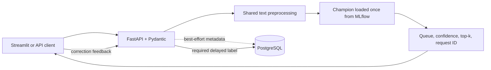
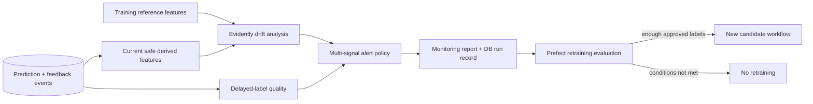
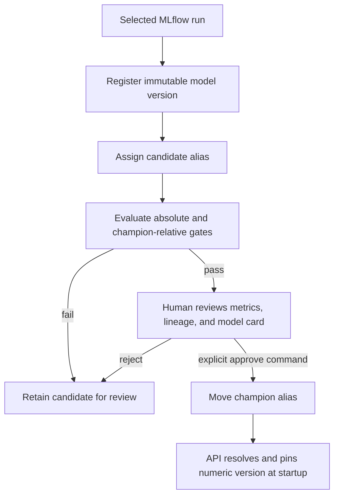
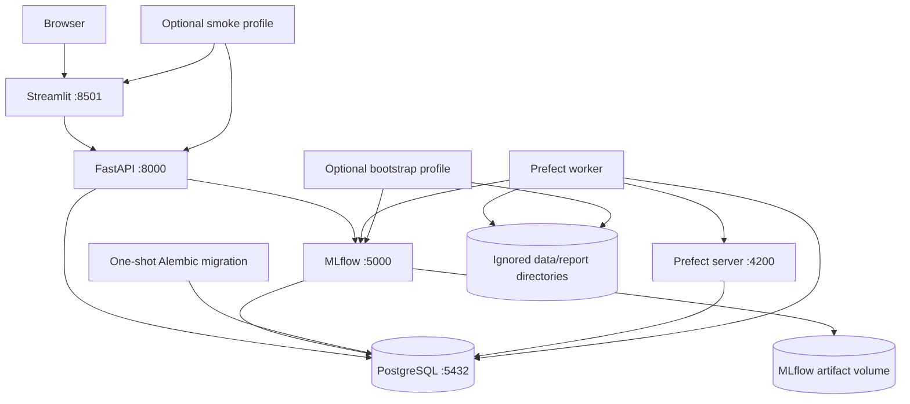

# Production MLOps Ticket Router

[](https://github.com/vijaypratap3364/production-mlops-ticket-router/actions/workflows/ci.yml)

A complete, local-first MLOps system that routes English customer-support tickets to one of ten
support queues. It covers reproducible ingestion, leakage-safe evaluation, MLflow experiment and
registry workflows, FastAPI inference, PostgreSQL feedback, Evidently monitoring, controlled
Prefect retraining, a Streamlit demonstration UI, Docker Compose, CI, and measured benchmarking.

The entire stack uses open-source software and local services. It requires no hosted inference API,
cloud account, credit card, or paid infrastructure.

## Business problem

Support organizations receive tickets faster than people can manually triage them. Incorrect
routing increases first-response time and creates avoidable handoffs. This project predicts the
destination queue from only the information available when a ticket arrives: `subject` and `body`.
It deliberately excludes answers, tags, priority, ticket type, assigned agents, resolutions, and
the target queue from predictive features because those fields can reveal post-submission outcomes.

The output is decision support, not an autonomous high-impact decision. Low-confidence predictions
are flagged for review, and operators can submit a corrected queue as a delayed label.

## Verified results

These values come from the checked project artifacts described in [the model
card](docs/model-card.md) and [benchmark report](docs/benchmarking.md). They are not estimates.

| Result | Actual measurement |
|---|---:|
| Normalized English tickets | 28,190 |
| Target queues | 10 |
| Train / validation / sealed test | 19,729 / 4,232 / 4,229 |
| Selected model | Word TF-IDF + calibrated LinearSVC |
| Validation macro F1 | 0.678889 |
| Final test macro F1 | 0.696057 |
| Final test weighted F1 | 0.688432 |
| Final test accuracy | 0.689761 |
| Minimum test per-class recall | 0.468254 |
| Serialized champion size | 9.565703 MiB |
| Local loopback API p95 | 21.308660 ms |
| Bounded Locust run | 131 requests, 0 failures, 82 ms p95 |
| Reliability scenarios | 9 of 9 passed |

The final test set was opened once only after candidate selection and configuration were frozen.
Local benchmark results describe one Windows development machine and are not public service-level
guarantees.

## System capabilities

- Revision-pinned Hugging Face download, cached reuse, SHA-256 manifests, and UTC/Git lineage.
- Pandera data contracts, deterministic top-ten class selection, aggregate EDA, and data card.
- Conservative PII masking and duplicate-grouped 70/15/15 stratified splitting with seed 42.
- Dummy, logistic-regression, ComplementNB, character, combined, and calibrated LinearSVC
  sparse-text experiments without validation/test vocabulary leakage.
- MLflow tracking with PostgreSQL backend, local artifact volumes, model signatures, and immutable
  candidate/champion aliases.
- Human-approved promotion gates covering macro F1, per-class recall, regression tolerance,
  latency, loadability, signature, and prediction contract.
- Lifespan-loaded FastAPI champion inference, calibrated top-k responses, Prometheus metrics, and
  graceful optional-analytics degradation.
- SQLAlchemy 2 and Alembic persistence for privacy-safe prediction metadata, delayed labels,
  monitoring runs, and retraining lineage.
- Evidently drift reports over explicit derived features plus delayed-label quality monitoring.
- Prefect ingestion, candidate, monitoring, and conditional-retraining flows that never promote a
  champion automatically.
- API-only Streamlit dashboard, bounded Locust workload, automated tests, coverage, and CI builds.

## Architecture

### Offline training pipeline

```mermaid
flowchart LR
    HF["Pinned Hugging Face snapshot"] --> DL["Download + raw manifest"]
    DL --> N["Normalize English tickets"]
    N --> V["Pandera validation + EDA"]
    V --> C["Config-driven top 10 classes"]
    C --> S["Duplicate-grouped 70/15/15 split"]
    S --> T["Train-only CV and candidate search"]
    T --> M["MLflow runs + artifacts"]
    M --> F["Freeze selected configuration"]
    F --> E["One authorized sealed-test evaluation"]
    E --> R["MLflow candidate version"]
```



### Online inference path



### Monitoring and feedback loop



### Model promotion workflow



### Docker service architecture



The dashboard is an HTTP client only. Modeling, data, registry, monitoring, database, and
orchestration code never import or execute dashboard code.

## Repository structure

```text
production-mlops-ticket-router/
├── src/ticket_router/
│   ├── data/             # Download, normalize, validate, analyze, split, manifests
│   ├── features/         # Shared preprocessing and predictive-feature allowlist
│   ├── modeling/         # Baselines, candidates, evaluation, MLflow logging
│   ├── registry/         # Final evaluation, gates, registration, promotion
│   ├── api/              # FastAPI adapter, contracts, service, metrics
│   ├── db/               # SQLAlchemy models, repositories, privacy, sessions
│   ├── monitoring/       # Reference features, Evidently drift, quality, policy
│   ├── orchestration/    # Prefect tasks, flows, deployments, retraining data
│   ├── dashboard/        # Streamlit pages and typed API client only
│   └── benchmarking/     # Champion contract, latency, load and reports
├── configs/              # Versioned non-secret data/model/policy configuration
├── migrations/           # Reviewed Alembic migrations
├── load_tests/           # Bounded synthetic Locust workload
├── scripts/              # Cleanup, smoke and operational validation
├── tests/                # Unit, integration and opt-in Compose e2e tests
├── docs/                 # Cards, runbooks, policies, ADRs and reviewer guides
├── docker/               # Non-root service Dockerfiles and entrypoints
├── data/                 # Ignored generated data; placeholders are tracked
└── artifacts/            # Ignored generated artifacts except reviewed resume evidence
```

## Technology stack

| Area | Technology |
|---|---|
| Runtime and packaging | Python 3.12, uv, hatchling, Pydantic Settings, structlog |
| Data | Hugging Face datasets/hub, pandas, Polars, Pandera, Parquet |
| Modeling | scikit-learn, TF-IDF, LogisticRegression, ComplementNB, calibrated LinearSVC |
| Experiments and registry | MLflow with PostgreSQL backend and local artifact volume |
| Serving and persistence | FastAPI, Pydantic, SQLAlchemy 2, Alembic, PostgreSQL |
| Monitoring and workflows | Evidently, Prometheus metrics, Prefect 3 |
| Demonstration | Streamlit |
| Operations and quality | Docker Compose, pytest, coverage, Ruff, mypy, pre-commit, Locust, GitHub Actions |

## Data source and license

The project uses the synthetic
[`Tobi-Bueck/customer-support-tickets`](https://huggingface.co/datasets/Tobi-Bueck/customer-support-tickets)
dataset by Tobi Bueck / Softoft, DOI
[`10.57967/hf/6184`](https://doi.org/10.57967/hf/6184). The upstream dataset card marks it
**CC BY-NC 4.0**, so it is restricted to attributed noncommercial use under those terms. The data is
not redistributed here; all downloaded and processed files remain ignored.

Only English records are retained. `subject` and `body` are the sole source features, and `queue` is
the target. The original project code is licensed under [MIT](LICENSE), which does not relicense the
dataset. See [data source](docs/data-source.md), [data card](docs/data-card.md), and
[privacy statement](docs/privacy.md).

## Requirements

- Git.
- Python 3.12 and [`uv`](https://docs.astral.sh/uv/getting-started/installation/) for host workflows.
- Docker Desktop or another Compose-compatible local engine for the complete stack.
- Enough local disk and memory for PostgreSQL, MLflow, model artifacts, and full-data training.

No service in this repository requires payment. GitHub Actions is optional; every core check has a
local command.

## Quick start with Docker Compose

This is the most complete reviewer path. The first bootstrap downloads the public dataset and runs
CPU-oriented training, so it requires network access and can take substantial time.

```bash
git clone https://github.com/vijaypratap3364/production-mlops-ticket-router.git
cd production-mlops-ticket-router
cp .env.example .env
# Replace the two change-me placeholder secrets in .env before starting services.
docker compose build api dashboard mlflow prefect-worker
docker compose up -d postgres mlflow migrate api dashboard
docker compose --profile bootstrap run --rm bootstrap
docker compose restart api
docker compose --profile smoke run --rm smoke-test
```

Open these local addresses:

- Streamlit: `http://127.0.0.1:8501`
- FastAPI/OpenAPI: `http://127.0.0.1:8000/docs`
- MLflow: `http://127.0.0.1:5000`
- Prefect, when its profile is started: `http://127.0.0.1:4200`

On Windows PowerShell, replace `cp .env.example .env` with
`Copy-Item .env.example .env`. Read [deployment](docs/deployment.md) and the detailed
[Docker runbook](docs/docker.md) before bootstrap or reset operations.

## Local non-Docker setup

Install the locked Python environment:

```bash
uv python install 3.12
uv sync --locked --all-groups
cp .env.example .env
uv run python -c "import ticket_router; print(ticket_router.__version__)"
```

Without `DATABASE_URL`, FastAPI uses a non-durable in-memory repository suitable for tests and a
single-process demonstration. A usable API still requires a registered champion at the configured
MLflow URI. To build one from a clean checkout, complete the ingestion, experiment, final
evaluation, and explicit promotion sequence below. Local MLflow can use its documented file/SQLite
fallback; durable multi-service operation uses Compose.

Start the host processes in separate terminals after a champion exists:

```bash
uv run uvicorn ticket_router.api.main:app --host 127.0.0.1 --port 8000
uv run streamlit run src/ticket_router/dashboard/app.py --server.address 127.0.0.1 --server.port 8501
```

The network-free orchestration smoke path is:

```bash
uv run python -m ticket_router.orchestration.fixture_flow
```

## Reproduce data ingestion

All generated data is local and ignored. The downloader refuses silent replacement unless
`--force` is supplied.

```bash
uv run python -m ticket_router.data.download
uv run python -m ticket_router.data.normalize
uv run python -m ticket_router.data.analyze
uv run python -m ticket_router.data.prepare
```

The pipeline records requested/resolved source revision, source license, row/column metadata, Git
identity when available, configuration and file hashes, selected classes, duplicate analysis, and
split integrity. Exact normalized-text groups cannot cross splits; contradictory groups are
excluded rather than assigned a guessed label.

## Train and select a model

```bash
uv run python -m ticket_router.modeling.train_baseline
uv run python -m ticket_router.modeling.train_candidates
```

Baselines and candidates fit vocabulary and estimators on training data only. Candidate search uses
stratified cross-validation within the training split; the validation split is used once for final
candidate comparison. Macro F1 is primary because the 10-class dataset has a measured 20.3885
largest-to-smallest class ratio.

## Final evaluation and Model Registry

After reviewing the Stage 6 leaderboard and freezing the selected configuration:

```bash
uv run python -m ticket_router.registry.evaluate_final
uv run python -m ticket_router.registry.promote --approve
```

Before creating a repository release tag, attest the clean Git commit against the immutable champion
without retraining, reevaluating the sealed test set, or moving an alias:

```bash
uv run python -m ticket_router.registry.attest_release --release v1.0.0
```

The command rechecks split hashes, promotion lineage, model loading, prediction behavior, and the
MLflow signature. It writes an ignored audit artifact under `artifacts/reports/releases/` and adds
release-specific tags to the existing champion version. Historical training lineage is preserved;
missing historical metadata is never fabricated.

`evaluate_final` is the only authorized path to the sealed test data. Its audit prevents repeated
test evaluation, registers the evaluated version as `candidate`, and records every gate. Promotion
is deliberately separate and human-triggered. The current reviewed local state is
`ticket-router` version 1 with both `candidate` and `champion` aliases pointing to version 1.

MLflow records model/search parameters, aggregate and per-class metrics, configuration/data hashes,
Git identity when available, package versions, duration, latency, size, plots, reports, model
signature, safe input example, and fitted model artifact. See [candidate
experimentation](docs/candidate-experimentation.md) and [model card](docs/model-card.md).

## API usage

The API loads the numeric version behind `champion` once during lifespan. It never trains or reloads
for each request.

```bash
curl --fail http://127.0.0.1:8000/health
curl --fail http://127.0.0.1:8000/ready
curl --fail http://127.0.0.1:8000/model

curl --fail --request POST http://127.0.0.1:8000/predict \
  --header "Content-Type: application/json" \
  --data '{"subject":"Invoice question","body":"Please explain this charge."}'
```

The response contains a request ID, predicted queue, calibrated confidence, ordered top-k results,
model identity, timestamp, and optional low-confidence warning. Batch prediction and create-once
feedback are available at `/predict/batch` and `/feedback`; Prometheus-compatible metrics are at
`/metrics`. See the complete [API contract](docs/api.md).

## Dashboard

Open `http://127.0.0.1:8501` after the API is ready. The five pages support:

- single-ticket routing, top-three predictions, latency, and correction feedback;
- bounded CSV batch routing with a result download that excludes ticket text;
- drift and delayed-label monitoring summaries;
- champion lineage, actual metrics, selected classes, and limitations;
- API, database, MLflow, monitoring, and retraining status.

The dashboard calls FastAPI only; it never imports the model or queries PostgreSQL. See
[dashboard documentation](docs/dashboard.md).

## Monitoring and feedback

```bash
uv run alembic upgrade head
uv run python -m ticket_router.monitoring.build_reference
uv run python -m ticket_router.monitoring.run --lookback-days 7
uv run python -m ticket_router.monitoring.simulate_drift
```

Evidently receives explicit safe derived fields such as lengths, word count, character ratios, URL
and email-marker counts, predicted label, confidence, and low-confidence flag—not raw free-form
text. Delayed labels add macro/weighted F1, per-class recall, correction/acceptance rates, and
confidence-versus-correctness when the feedback minimum is met. Statuses combine multiple signals
and include `insufficient_data`; one small drifted batch cannot trigger retraining alone. See
[monitoring](docs/monitoring.md).

## Controlled retraining

```bash
uv run python -m ticket_router.orchestration monitor
uv run python -m ticket_router.orchestration retraining
uv run python -m ticket_router.orchestration retraining --manual-trigger
```

Retraining requires a multi-signal trigger, enough new approved delayed labels, a versioned parent-
linked dataset, and the normal candidate gates. It may update `candidate`; it cannot update
`champion`. Promotion always remains the separate explicit command. See
[retraining](docs/retraining.md) and [orchestration](docs/orchestration.md).

## Testing and CI

Run the same core checks used by the repository:

```bash
uv sync --locked --all-groups
uv run ruff format .
uv run ruff format --check .
uv run ruff check .
uv run mypy src tests scripts load_tests
uv run pytest
uv run pre-commit run --all-files
```

Coverage is branch-aware and fails below 80%. Tests use small deterministic synthetic fixtures and
do not download the full dataset or train the full model in ordinary CI. PostgreSQL integration
tests use a disposable test database; full Compose e2e is opt-in. CI also builds the package and all
production images but never deploys, opens the sealed test set, or moves an alias. See
[CI documentation](docs/ci.md) and [contributing guide](CONTRIBUTING.md).

## Benchmarking

With an already-bootstrapped local stack:

```bash
uv run python -m ticket_router.benchmarking.contract
uv run python -m ticket_router.benchmarking.load_test
uv run python scripts/operational_validation.py --run-compose-disruptions
uv run python -m ticket_router.benchmarking
```

The final measured run used champion version 1 and synthetic non-sensitive requests. Direct
single-request p50/p95/p99 was 5.639900/11.411565/12.464165 ms; loopback API p50/p95/p99 was
15.274450/21.308660/23.411020 ms. The bounded Locust CSV recorded 131 requests, zero failures,
82 ms p95, and 4.483186 requests/s. See [benchmarking](docs/benchmarking.md) for hardware, hashes,
definitions, targets, and interpretation limits.

## Documentation index

- [Implementation plan](docs/implementation-plan.md)
- [Data source](docs/data-source.md) and [data card](docs/data-card.md)
- [Baseline modeling](docs/baseline-modeling.md), [candidate experiments](docs/candidate-experimentation.md), and [model card](docs/model-card.md)
- [API](docs/api.md), [database](docs/database.md), and [dashboard](docs/dashboard.md)
- [Monitoring](docs/monitoring.md), [retraining](docs/retraining.md), and [orchestration](docs/orchestration.md)
- [Deployment](docs/deployment.md), [Docker runbook](docs/docker.md), and [privacy](docs/privacy.md)
- [Benchmarking](docs/benchmarking.md), [demo script](docs/demo-script.md), and [interview notes](docs/interview-notes.md)
- [README command verification](docs/command-verification.md) and [resume evidence](docs/resume-bullets.md)
- [Architecture decisions](docs/adr/README.md), [security policy](SECURITY.md), and [contributing](CONTRIBUTING.md)

## Limitations

- The dataset is synthetic, repetitive, noncommercially licensed, and not evidence of performance
  on organic production tickets.
- Queue taxonomy and imbalance are source-specific; minority-class recall remains the main model
  weakness, with minimum test recall 0.468254.
- Language filtering trusts the source label rather than an independent detector.
- Exact duplicate protection is implemented; semantic near-duplicate detection is deliberately
  conservative.
- Local Compose has no public-network TLS, authentication, external secret manager, high
  availability, autoscaling, or disaster-recovery system.
- Benchmark traffic is bounded and short; it is not a long soak, multi-worker, or distributed test.
- Feedback can be selection-biased and must be reviewed before inclusion in retraining.
- Generated data, models, experiment stores, and reports are intentionally absent from Git and must
  be reproduced.

## Future improvements

- Validate on governed real-world tickets with independently reviewed labels and privacy controls.
- Add semantic duplicate detection and an independently evaluated language detector.
- Run longer multi-worker soak tests and define SLOs only after repeated measurements.
- Add authentication, TLS termination, rate limits, role separation, backups, and a secret manager
  before any non-local deployment.
- Automate retention enforcement and signed lineage/attestation for data and model artifacts.
- Evaluate incremental vocabulary/OOV monitoring and alternative sparse linear models before
  considering a transformer.
- Add a human approval UI that records reviewer identity and rationale without weakening the
  command-line promotion gate.

## License and responsible use

Original project code is available under the [MIT License](LICENSE). The upstream dataset remains
CC BY-NC 4.0 and is not included. Review [SECURITY.md](SECURITY.md) and
[docs/privacy.md](docs/privacy.md) before using anything beyond a local portfolio demonstration.
