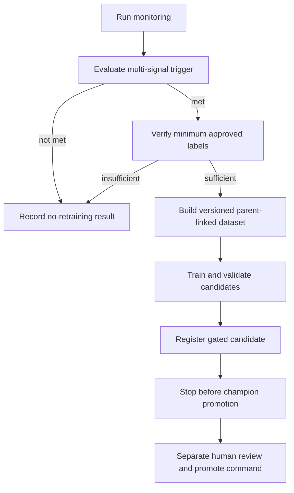

# Controlled retraining policy

Retraining is a proposal-and-candidate workflow, not an automatic champion replacement. Prefect
coordinates existing application services; it does not bypass dataset, evaluation, registry, or
promotion contracts.

## Trigger policy

Versioned thresholds live in `configs/orchestration.yaml` and `configs/monitoring.yaml`. Retraining
may be proposed for:

- sustained `critical` multi-signal drift;
- enough new reviewed feedback labels plus macro-F1 decline beyond tolerance;
- sustained low-confidence-rate increase with corroborating evidence;
- an explicit manual trigger that still meets the label minimum.

One small drifted batch is insufficient. `insufficient_data` is not a trigger. The policy requires
the configured number of critical monitoring windows and a minimum approved-label count before
training.

## Approved retraining data

The API intentionally does not retain raw subject/body, so PostgreSQL is not silently converted into
a training corpus. A human-reviewed export must be placed at the ignored path
`data/retraining/inbox/approved_labeled_tickets.parquet` with:

| Column | Contract |
|---|---|
| `request_id` | Stable source request ID |
| `subject`, `body` | Reviewed inputs; at least one is usable |
| `queue` | Approved label from the existing mapping |
| `label_created_at` | Timezone-aware label timestamp |
| `approved` | Explicit boolean approval for training use |

The builder filters the requested UTC period, rejects unapproved or unknown labels, removes
duplicates against the sealed holdout groups, preprocesses with the shared stateless policy, and
appends approved rows to training only. Validation and test remain unchanged.

Each run creates an immutable parent-linked manifest recording source period, included/excluded
counts, feedback-label count, source/output hashes, parent training hash, configuration, timestamp,
and Git identity when available.

## Workflow



The run is persisted in `retraining_runs` with trigger, source period, status, optional MLflow run,
candidate version, gate results, and timestamps. Idempotency keys/manifests prevent a retry from
silently creating different data for the same logical run.

## Commands

Direct local execution:

```bash
uv run python -m ticket_router.orchestration monitor
uv run python -m ticket_router.orchestration retraining
uv run python -m ticket_router.orchestration retraining --manual-trigger
```

Registered Prefect deployments after starting a local worker:

```bash
uv run prefect deployment run "monitoring-flow/daily-monitoring"
uv run prefect deployment run "conditional-retraining-flow/weekly-retraining-evaluation"
```

If a new candidate passes gates, review its MLflow lineage, validation/error analysis, dataset
manifest, model card impact, and gate report. Promotion remains explicit:

```bash
uv run python -m ticket_router.registry.promote --approve
```

That command must not be embedded in a monitoring flow, retraining flow, schedule, service startup,
or CI job.

## Failure and rollback behavior

- Temporary service/network tasks use bounded retries; model fitting and registry mutations are not
  result-cached.
- A failed or ineligible candidate leaves the current champion unchanged.
- An interrupted run records a failure state and can be audited from database/Prefect/MLflow IDs.
- Rollback means explicitly reviewing and reassigning the champion alias to a previously verified
  immutable version, then restarting/reloading the API. Never delete lineage to hide a bad run.

See [orchestration](orchestration.md), [monitoring](monitoring.md), [model card](model-card.md), and
[ADR 0003](adr/0003-human-controlled-model-promotion.md).
